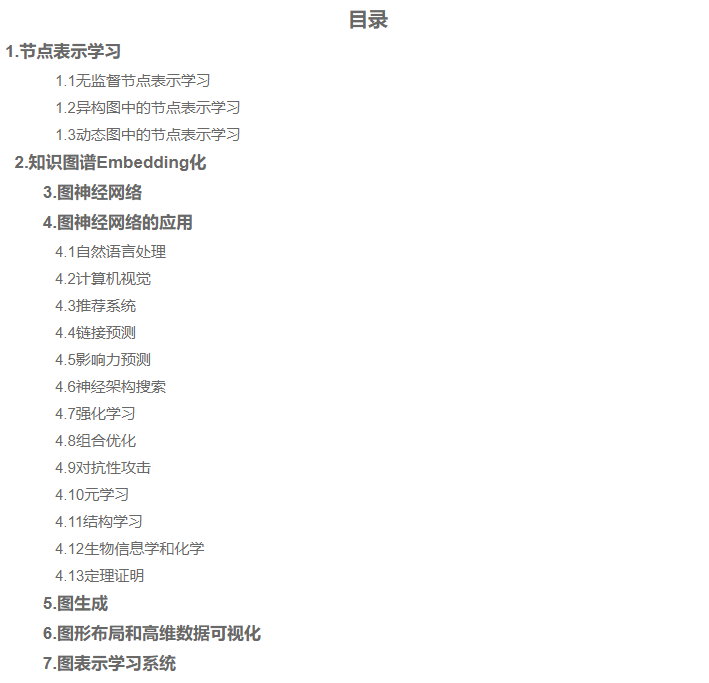

## GNN论文大全
[Literature of Deep Learning for Graphs](https://github.com/DeepGraphLearning/LiteratureDL4Graph#node-representation-learning)：这是一个有关于图神经网络论文资源大全

## GCN教程
[GNN-algorithms](https://github.com/wangyouze/GNN-algorithms)：图神经网络相关算法详述及实现教程。

受到pytorch_geometric的启发，我们开发了基于Tensorflow的GNN库:tf_geometric，其中集成了高效且对科研工作者友好的GNN模型。GNN-algorighms则是基于tf_geometric对近几年如火如荼的图神经模型进行详述以及手把手教大家实现GNN模型的教程。
